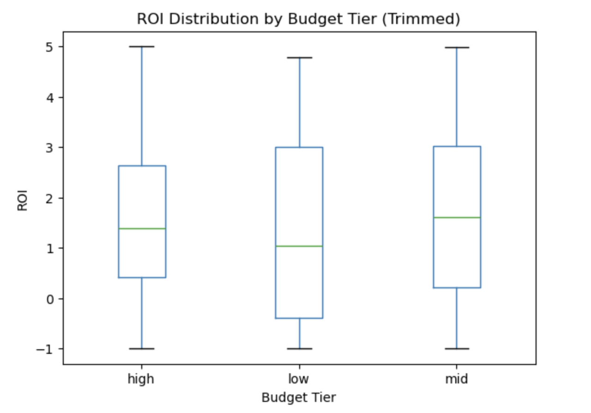

# The-Changing-Economics-of-Big-Budget-Films

The Changing Economics of Big Budget Films (2015–2024)

Overview

This project works to analyze if production budget has become a less reliable predictor of financial success in the modern film industry. Using The Movie Database (TMDb) API data from 2015–2024, the analysis draws focus on profitability and return on investment (ROI) with particular attention to high budget films and genre specific risk. The project also acts as a personal case study and at its core will serve as a bounce off foundation for self learning Python as well as how to analyze and visualize data ☺︎

To account for the structural disruption caused by the COVID-19 pandemic, the years 2020–2021 are analyzed separately from pre- and post-COVID periods.

Research Questions

This analysis is guided by five core questions:

Has the relationship between production budget and box office revenue weakened in the last decade?

Are high budget films less efficient than mid and low budget films today?

Has the failure rate of high budget films increased over time?

Do certain genres absorb high budget risk better than others?

Are modern box office successes driven more by outliers than consistency?

Dataset

Source: The Movie Database (TMDB) API (v3)

Timeframe: 2015–2024

Sampling: Top 100 most popular films per year

Final dataset size: ~500 films with valid budget and revenue data

Key Variables

Budget

Revenue

Profit (Revenue − Budget)

ROI (Profit ÷ Budget)

Budget tier (low / mid / high, based on distribution)

Era (pre-COVID, COVID, post-COVID)

Primary genre

Key Findings
Budget Is a Less Reliable Predictor Than Before

While production budget remains positively correlated with revenue, this relationship has become significantly more volatile in the post-COVID era. Year to year correlation fluctuates rather than stabilizes, suggesting increased uncertainty in big budget investments.

High Budget Films Fail More Often

The proportion of high budget films that lose money rises sharply during COVID (2020), but failure rates remain elevated even after theatrical recovery, indicating a structural increase in downside risk rather than a temporary shock.

Efficiency Favors Smaller Budgets

Low budget films achieve the highest median ROI

High budget films exhibit the greatest downside risk

Large budgets increase revenue potential, but they reduce efficiency and amplify losses when films underperform.

Genre Matters at the High End

Among high budget films:

Action and adventure genres show greater resilience and lower failure rates

Science fiction displays a boom or bust profile, combining high upside with elevated risk, likely due to high fixed costs associated with visual effects and world building

Key Visualizations

(Recommended: add screenshots of these charts to the README)

Budget vs Revenue (log scale), split by era

Budget–Revenue correlation over time (with COVID highlighted)

Failure rate of high budget films by year

ROI distribution by budget tier (trimmed for outliers)

Risk vs Return scatter by genre (high budget films)

Tip: You can add chart images by creating a visuals/ folder and embedding them like:

Limitations

TMDB revenue data is self reported and may be incomplete.

Marketing and distribution costs are not included, likely understating total investment.

Popularity based sampling may bias results toward higher visibility films.

Despite these limitations, the analysis highlights meaningful shifts in risk dynamics within modern film production.

Dependencies & Requirements
Environment

Python 3.9+

Jupyter Notebook

Libraries

pandas

numpy

matplotlib

requests

Install via:

pip install pandas numpy matplotlib requests

API Access

A TMDB API key is required to reproduce the data collection step.
The notebook expects the key to be set as an environment variable:

export TMDB_API_KEY="your_api_key_here"

Repository Structure
├── 01_analysis_tmdb_profitability.ipynb
├── data/
│   └── tmdb_movies_2015_2024_popularity_top.csv
├── visuals/
├── README.md

Why This Project

This project was designed to explore real world financial risk in a creative industry, combining API data collection, feature engineering, exploratory analysis, and data visualization to answer a contemporary business question.
